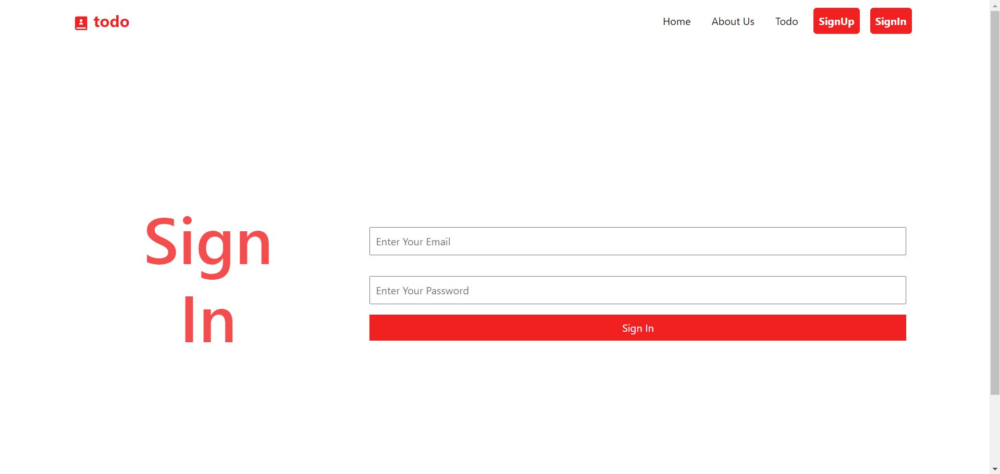
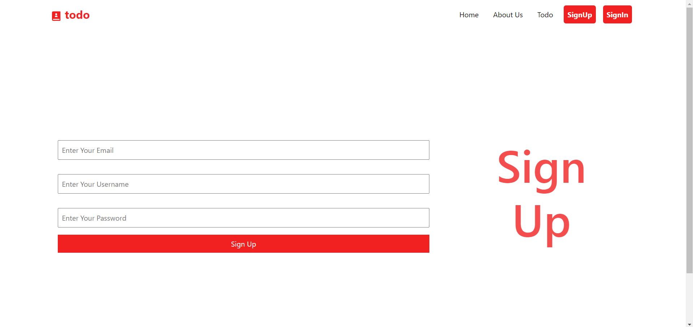
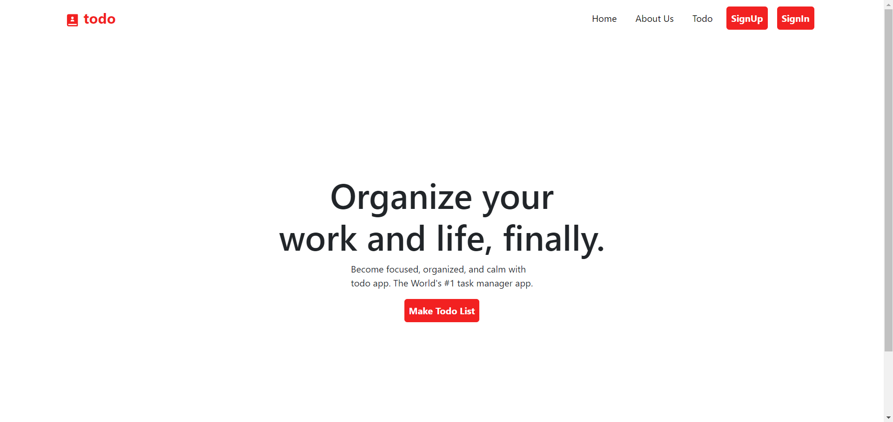
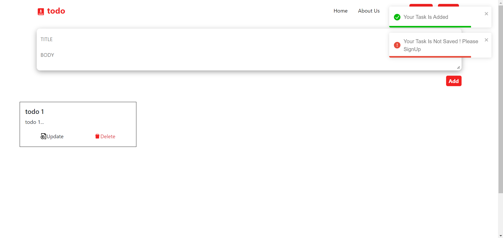
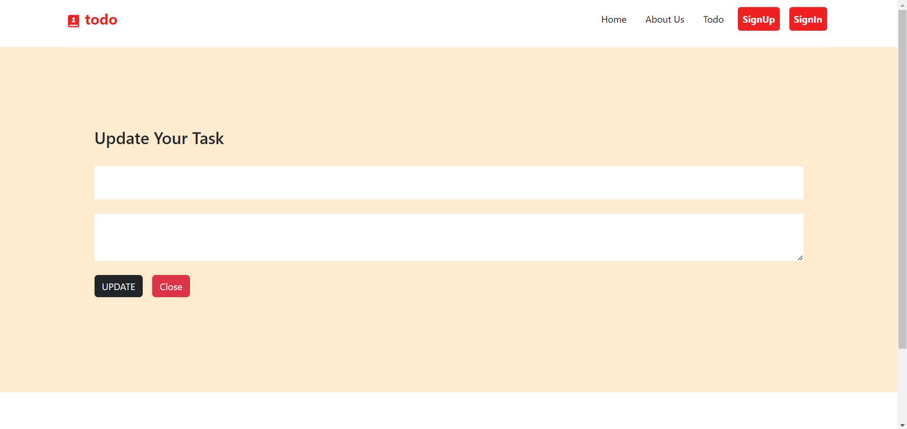

# To-Do Task Manager Application

## Overview

This project is a To-Do Task Manager application built using the MERN stack (MongoDB, Express.js, React, and Node.js). The application allows users to create, update, and delete to-do tasks, which are saved and accessible upon signing in. The application features an authentication setup with login and sign-up screens, as well as additional screens for "About Us", "Home", and "To-Do List".

## Features

- **Authentication**: Secure login and sign-up functionality to manage user accounts.
- **Home Screen**: Welcome screen for users upon logging in.
- **About Us Screen**: Provides information about the application and its creators.
- **To-Do List Management**: Users can list new to-dos, update existing ones, and delete tasks.
- **Persistent Data**: To-dos are saved to the database and persist across sessions.
- **Enhanced UI**: User-friendly interface for easy navigation and task management.

## Screenshots

### Login Screen

### Sign-Up Screen

### Home Screen

### About Us Screen

### To-Do List Screen

### Update To-Do Screen

## Setup

1. Clone the repository or download the ZIP file.
2. Navigate to the project directory.
3. Install dependencies:
   'npm install'
4. Start the server:
'npm start'
5. Navigate to the frontend directory:
'cd frontend'
6. Run the Application:
'npm start'
7. Open your web browser and navigate to http://localhost:3000 to start using the application.

## License

This project is open-source and available under the [MIT License](LICENSE).

## Author

Sai Surya Talla

---
